### Precursor:

I've now tackled another mathematical, statistical and machine learning inclined course, "**ECE1508 - Reinforcement Learning**", during my Master's of Engineering at the Univeristy of Toronto. My partner Wangshun Xu and I chose our final project for this course to be an attempt at optimizing coverage for a set of UAVs for a set of users. 

I learned a lot during this course about the world of Reinforcement Learning, whether they be the classical algorithms or the more modern Deep Reinforcement Learning algorithms.

Here is the report that Wangshun and I put together summarizing our accomplishment for this UAV Coverage Optimization project:

Github Project Repository - https://github.com/DeluxeViper/RL_UAV_Coverage_Optimization

# Optimizing UAV Coverage for Distributed Users Using Deep Q-Learning

### Abstract

This  project  focuses  on  optimizing  UAV  (Unmanned  Aerial  Vehicle) coverage for users distributed randomly within a specified area using Deep Q-Learning. UAVs, acting as movable relays, aim to maximize user coverage by dynamically adjusting their positions. The environment is modeled on a 2D Cartesian coordinate system, where UAVs and users are randomly placed, and distances are calculated using the Euclidean formula.    The state space includes  UAV  locations,  while  the  action  space  consists  of  directional movements and stops. A deep reinforcement learning algorithm, specifically Deep Q-Learning, is employed to optimize UAV positions.    The reward function  is  designed  to  minimize  the  distance  between UAVs  and  users, encouraging  efficient  coverage.  The  project  explores  various  reward functions and their impact on coverage efficiency and UAV behavior.   This research aims to enhance UAV adaptability and performance in dynamic and real-world scenarios. 

### 1  Introduction

Optimizing  UAV  coverage  in  dynamic  environments  is  crucial  for  applications  like  disaster management,  surveillance,  and  telecommunications.  Traditional  methods,  including  classical reinforcement learning (RL), often struggle to adapt quickly to changing conditions and require extensive tuning, making them less effective in real-world scenarios. 

This project addresses the UAV coverage problem using Deep Reinforcement Learning (DRL), specifically Deep Q-Learning. DRL combines the decision-making strengths of RL with deep neural networks' ability to handle complex environments. This approach allows UAVs to learn optimal positioning strategies directly from environmental interactions, enhancing their adaptability and efficiency. 

Our  objective  is  to  develop  a  DRL-based  framework  that  maximizes  user  coverage  in  a  2D environment  by  optimizing  UAV  positions.  The  environment  is  modeled  using  Cartesian coordinates, with UAVs and users placed randomly, and distances calculated via the Euclidean formula. The project aims to demonstrate the effectiveness of DRL in real-time UAV coverage optimization, offering a more adaptive solution for complex, dynamic scenarios. 

### 2  Preliminaries

To address the UAV coverage optimization problem, we model the scenario as a reinforcement learning  (RL)  task  within  a  2D  environment.  The environment  is  represented  by  a  Cartesian coordinate system, where both UAVs and users are randomly placed on a map. The primary goal is to optimize the positions of UAVs to maximize coverage of users distributed across this area. To introduce preliminaries for this paper, let’s define the agent, the environment, the state space, action space, the reward functions (briefly) and the problem formulation. 

In terms of agents, each UAV is considered an agent. The agent's task is to determine the optimal movement strategy to maximize user coverage while minimizing overlap with other UAVs and avoiding inefficient coverage patterns. 

The environment consists of a 2D grid where users and UAVs are placed. The UAVs can move in discrete steps (with constant velocity) across the grid, with the action space consisting of five possible actions: move left, move right, move up, move down, or stay in place. The users in this environment move with a random constant velocity and change velocity and direction randomly once they bounce off the wall. 

The state space is defined by the current positions of all UAVs on the grid. Each state is represented as a set of coordinates (x, y) for each UAV, where n is the number of UAVs. 

The action space includes five discrete actions: move left, move right, move up, move down, or stay still. These actions allow the UAVs to navigate the grid in an attempt to improve coverage of users.  

In addition, the reward functions used were several and will be further discussed in the Deep RL implementation section of the document. 

This problem is formulated as a Markov Decision Process (MDP), where the UAVs interact with the environment by taking actions based on the current state to maximize the cumulative reward. The challenge is for the UAVs to learn a policy that efficiently covers as many users as possible, balancing the need for wide coverage with the avoidance of overlaps and inefficient configurations. 

### 3  Solution via Classical RL Algorithms

Classical RL approaches, including Monte Carlo, SARSA, and Q-learning, are constrained by the need for a complete and accurate model of the environment. While these methods can yield robust policies after extensive training, their effectiveness diminishes in real-world scenarios such as UAV coverage, where environmental conditions can change unpredictably. An optimal policy derived for one specific environment may not be effective in another due to these variations. To add a bit more detail, let's briefly walk through each potential classical RL algorithm/approach and their advantages vis-à-vis their disadvantages: 

The Monte-Carlo algorithm has advantages such as being able to converge (provided enough episodes) and simplicity in implementation and episodes. However, the disadvantages include high variance in estimates (especially with large state spaces), requiring a large number of episodes, and delayed updates upon episode completion. The SARSA algorithm yields benefits such as the ability to balance between the exploration and exploitation naturally, being more sample efficient than Monte Carlo, but has disadvantages such as not sufficiently exploring the policy and potential bias within the learning process. The Q-learning algorithm boasts the advantages of being able to learn the optimal policy while following exploratory policies, can converge given enough exploration, and is more efficient than Monte Carlo methods. The disadvantages prove to be similar to the previous two algorithms, particularly requiring a large number of episodes and carefully tuned parameters to avoid suboptimal policies, as well as being more complex to implement. 

Thus, classical RL approaches typically require extensive training for each unique environment, which can be impractical in real-world applications. Each interaction during the training process can be  costly  and  time-consuming,  making  these  methods  less suitable  for  scenarios  where  rapid adaptation to new conditions is essential. This limitation underscores the need for more adaptive and efficient learning algorithms capable of handling the complexities and dynamics of real-world environments like UAV deployment. 

### 4  Deep RL Implementation

**DQN architecture**: 

The team designed a Deep Q Network to solve the UAV coverage Optimization problem. The team used a simple feedforward neural network as the Q-Network, there are two versions of neural networks deep on device computation load and the complexity of the environment. As the DQN architecture shows, the simple version of Q-Network is made of 2 hidden layers each layer has a size of 128. The slightly more advanced version is made with 3 hidden linear layers where layers start at 128 neurons in terms of output and reach 256 by the second layer. The third layer reduces the 256 neurons to 128 and produces an output in terms of an action size. 

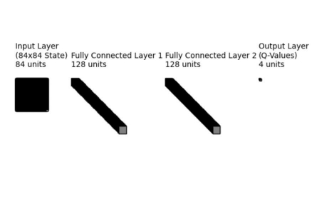

The team implemented a Deep Q-Network (DQN) agent for reinforcement learning tasks. The agent initializes its parameters including state and action sizes, memory for experience replay, discount factor, exploration rate, learning rate, batch size, and the neural networks for Q-value approximation and its target. The experience replay memory stores past experiences, allowing the agent to sample mini batches for training, which helps break the correlation between consecutive experiences and stabilizes the learning process. The agent selects actions based on an epsilon-greedy policy to balance exploration and exploitation. With a probability determined by  epsilon , it chooses a random action (exploration); otherwise, it selects the action with the highest predicted Q-value (exploitation). The exploration rate decays over time, shifting the focus towards exploitation as learning progresses. 

The  training  process,  encapsulated  in  the  replay  method,  involves  sampling  a  mini-batch  of experiences from memory, computing current and target Q-values using the model and target model, and updating the Q-values based on the Bellman equation. The agent calculates the loss between predicted and target Q-values, performs back-propagation, and updates the model's parameters using the Adam optimizer. After each training step, the exploration rate is decayed to gradually reduce exploration. Additionally, the weights of the target model are periodically updated to match those of the model, providing stable Q-value targets during training and improving convergence. Through these methods, the  DQNAgent  class effectively enables the agent to learn from past experiences, balance exploration and exploitation, and achieve stable and efficient learning. 

### Environment architecture

Custom OpenAI Gym environment designed to simulate the movement and interaction of users and UAVs (Unmanned Aerial Vehicles) within a defined area. It initializes with parameters such as the number of users, the number of UAVs, the size of the area, and the maximum steps allowed per episode. The environment defines an observation space representing the positions of users and UAVs and an action space for the UAVs, allowing them to move in discrete directions. 

Upon resetting the environment, users are randomly placed within the area, and their velocities are initialized to random values between -0.3 and 0.3. UAVs are positioned at the centroids of user clusters determined using the K-means clustering algorithm. This initial setup ensures that the UAVs start at strategic locations to minimize the average distance to users. As the simulation progresses, UAVs and users update their positions based on defined rules and actions. UAVs adjust their positions according to the given actions, which can be one of five choices: move left, move down, move right, move up, or stay in place. Users move based on their velocities, with boundary checks to ensure they remain within the area. When users hit the boundaries, they are assigned new velocities and directions to stay within the area. The environment provides a dynamic and realistic scenario for testing and training reinforcement learning algorithms. 

### Reward Function:

1.**Exponential Decay -** Calculate the Euclidean distance between the UAV and each user, then compute exponential decay (users closer to the UAV contribute more to the coverage, while those farther away contribute less, thus UAV serves nearby users)** 
2.**Exponential  Decay  +  Penalize:**  This enhancement of the Exponential Decay reward introduces a penalty term. This penalty discourages UAVs from staying far from users. 
3.**Combined Reward:** Combines Exponential Decay and Distance Penalty rewards, adds penalties for overlapping UAV coverage, and rewards uniform coverage. 
4.**Maximizing Area coverage:** Give each UAV a radius, any user inside of the area will be given a +1 reward, and the outside users will be considered a -1 reward. This function will maximize the coverage of this map and move toward the user. Also, we don't want the agent to hit the boundary so there will be a penalty for hitting the boundary  
5.**Minimizing energy consumption:** The reward function will be like exponential Decay the agent receives a maximum +7 based on the distance, also to prevent the user from going too far away from the agent, we also have an exponential Decay to prevent the agent will not move far away from the agent, a maximum -5 reward if the user too far away. To minimize energy consumption, we added a -1 reward for each move of agent. 
6.**Compare previous average distance:** Calculate the Euclidean distance between the UAVs and each user. record the closer distance and use it to calculate the average distance and compare the average distance with the previous value. If the value decreases agent moves closer to the user, it will receive a positive reward. Vice versa, to prevent the agent from hitting the boundary, we have a -1-reward penalty when the agent hits the boundary. 
7.**Chasing clusters**: In this case, the reward function calculates n clusters via the k-means algorithm and the UAVs attempt to minimize the distance between themselves and the closest centroid clusters that are not assigned to another UAV. If the distance is greater than a hyperparameter (in the experiments we used 5), then it attempts to gravitate to the center. 

### Techniques Employed for Better Training Results:

1.**Adjusting Replay Memory**: This helped by experimenting between differing sets of experiences that the agents could learn by. A much larger experience could point to an agent considering all experiences as valuable and not extracting exploitability for actions and vice versa.  
2.**Epsilon Decay strategy**: Utilize an Epsilon reset mechanism every n epochs to employ a balanced exploration/exploitation policy 
3.**Adjusting the Reward Function (and reward function pitfalls):** We encountered many pitfalls when optimizing our reward function. This included things like the UAVs venturing to the walls and sticking there. We estimated that this was due to a localized minima that the UAVs couldn’t figure out of. To overcome the UAVs sticking to the wall, we used several techniques such as gradually increasing a penalty as it got to the wall (as using a large penalty would find itself getting stuck in a local minima), as well as introducing a repelling force that would provide a positive reward so it could see its way off the wall. In addition, making sure several variables being introduced into the reward function were not overpowering one another and that they were balanced and effective. 
4.**Adjusting Hyperparameters**: There are a plethora of hyperparameters that were used in these models and they were consisted tweaked to ensure that they were primed for training. 
5.**Terminal state:** This experiment involved selecting an effective terminal state as no concrete terminal state existed due to the nature of the dynamic users and the UAVs finding it difficult to reach convergence as a result. We introduced a terminal state via a new hyperparameter that would terminate the episode after a certain number of steps. 
6.**Evaluating  performance:**  We  were  able  to  determine  which  experiments  produced successful  results  via  evaluating  performance  using  a  myriad  of  metrics,  which  are coverage  overlap,  normalized  coverage  reward,  coverage  uniformity,  average  user distance, etc. which are discussed further in the following section. 
7.**Optimizing training epoch time:** While experimenting with different architectures and more complicated reward functions, in addition to introducing a more complex observation state (by including the UAVs or the user velocity for instance), we had to make a trade-off between choosing a model that took a while to train per episodes and thus given the time constraint train with fewer episodes, vis-à-vis a model that would train for more epochs and converge at a faster rate. 
8.**Introducing a target model:** We introduced a target model that updates every 10 epochs to improve convergence, and we did see a noticeable improvement. An example of this is demonstrated below particularly for the “chasing clusters” reward function (note: while the epochs differ, the pattern should hopefully be noticeable): 

- Loss graph with the target model updates: 

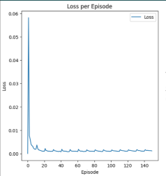

- Loss graph without target model updates: 

  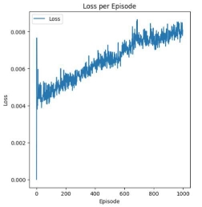

### 5  Numerical Experiments

Table 1: Experiment and the Hyperparameter setting (The other Hyperparameter team used the same number: Gama = 0.99, Epsilon decay = 0.995, CNN Architecture = A) 

|**Experiment #** |**Reward Function** |**Loss curve** |**Num UAVs** |**Num Users** |**Area Size** |**Learning Rate** |**Batch size** |**Num of epochs**  |
| :-: | - | - | :- | - | - | :-: | :-: | - |
|1 |1 |1 |2 |5 |10x10 |0\.0005 |256 |180 |
|2 |1 |2 |2 |10 |10x10 |0\.0005 |256 |500 |
|3 |2 |3 |1 |3 |10x10 |0\.0005 |256 |160 |
|4 |2 |4 |3 |10 |15x15 |0\.0005 |256 |500 |
|5 |3 |5 |3 |10 |15x15 |0\.0005 |256 |500 |
|6 |4 |6 |3 |10 |15x15 |0\.00005 |64 |300 |
|7 |5 |7 |3 |10 |15x15 |0\.00005 |64 |300 |
|8 |6 |8 |3 |10 |15x15 |0\.0001 |64 |300 |
|9 (experiment 11 in the Experiment results section) |7 |9 |2 |10 |20x20 |0\.0005 |64 |150 |

**Evaluation Matrix**: 

We used several metrics to test our UAVs through our experiments. The metrics we used were: 

1.**Coverage efficiency** - measure how effectively the UAVs cover the users 
2.**Coverage overlaps** - measure the overlap in coverage between UAVs, lower overlap mean the UAVs have better performance in user coverage, and when UAVs are redundant, overlapping coverage is not beneficial. 
3.**Normalize coverage reward** - we can normalize the reward by the number of users and UAVs to make it comparable across different configurations 
4.**Coverage uniformity** - evaluate how evenly distributed the UAVs are across the users. But The question arises for this: where would uniformity make sense if all the users would be bunched up in a certain area? 
5.**Average User Distance  -** use the Euclidean  formula  to  find  the  average  distance between users and agent. The lower value means a better performance 

### Experiment Result

**Experiment 3:**

An adjusted reward function to account for the UAVs sometimes being too far from the users would result in a very low magnitude of reward, which would mean that the UAV would effectively just stay at a wall. UAVs seem to cling to walls, need a hitting boundary penalty to address it 

**Experiment 4:**

UAVs perform well, they will track the user's movement and find a position that is closer to all the users. because we compare with the previous distance the agent is using a trick way to receive more reward by first moving far away and then moving close. Sometimes not all the agents will move to the optimal position. In 3 UAVs and 10 user cases, one UAV will be far away from the user. 

Average Reward over 5 Test Episodes: -8.87 Average User Distance: 2.79 

Average Coverage Overlap: 0.52 

Average Coverage Uniformity: 3.02 Average Normalized Reward: -0.2958 

**Experiment 5:**

UAVs clinging to walls and a decent amount of overlap noticed during testing Average Reward over 5 Test Episodes: 38.00 

Average User Distance: 2.42 

Average Coverage Overlap: 1.03 

Average Coverage Uniformity: 2.36 

Average Normalized Reward: 1.2667 

**Experiment 6:**

Adjusted reward function to include penalty for overlapping with other UAVs, reward for coverage uniformity 

Average Reward over 5 Test Episodes: -212.30 Average User Distance: 3.94 

Average Coverage Overlap: 0.40 

Average Coverage Uniformity: 1.29 

Average Normalized Reward: -7.0767 

**Experiment 7:**

Adjusted CNN architecture to B, UAVs still clinging to walls, UAVs moving slightly different, utilizing both x and y axis seemingly 

Average Reward over 5 Test Episodes: -268.78 Average User Distance: 3.27 

Average Coverage Overlap: 0.41 

Average Coverage Uniformity: 2.89 

Average Normalized Reward: -8.9593

**Experiment 9:** 

The movement of the agent is affected by coverage distance. When the coverage distance is small, the agent moves more frequently, but if the user is scattered, the agent will try to chase one of them. When the coverage distance is large, the agent will try to cover more ground and will stay still for more time 

Coverage distance = 3, UAVs = 3, User = 10, map size = 15x15: Average Reward over 5 Test Episodes: -184.00 

Average User Distance: 2.72 

Average Coverage Overlap: 0.26 

Average Coverage Uniformity: 4.76 

Average Normalized Reward: -6.1333 

Coverage distance = 4, UAVs = 3, User = 10, map size = 15x15: Average Reward over 5 Test Episodes: 285.60 

Average User Distance: 3.19 

Average Coverage Overlap: 0.00 

Average Coverage Uniformity: 5.69 

Average Normalized Reward: 9.5200 

Coverage distance = 5, UAVs = 3, User = 10, map size = 15x15: Average Reward over 5 Test Episodes: 282.80 

Average User Distance: 3.20 

Average Coverage Overlap: 1.35 

Average Coverage Uniformity: 3.56 

Average Normalized Reward: 9.4267

**Experiment 10:**

It has an unexpectedly good performance, but it is difficult to find a good balance between the distance reward of the user and the agent. If the distance reward is too low, the agent will be reluctant to move. The distance reward is too large to cause the agent to ignore the punishment of moving 

Average Reward over 5 Test Episodes: 350.17 Average User Distance: 2.50 

Average Coverage Overlap: 0.96 

Average Coverage Uniformity: 3.16 

Average Normalized Reward: 11.6723 

**Experiment 11:**

This experiment utilized the “Chasing clusters” reward function. It performed quite good when clusters existed for the users. When the clusters are formed by nearby users the UAVs tend towards them, otherwise they tend to the center. While the average user distance lags behind some of the previous experiments, the coverage overlap and the uniformity perform excellently. 

Average Reward over 10 Test Episodes: 30.36 Average User Distance: 3.84 

Average Coverage Overlap: 0.43 

Average Coverage Uniformity: 3.90 

Average Normalized Reward: 1.5178 

### 6  Answer Research Questions

**Parameter Sensitivity: How do different parameters (like learning rate, discount factor, and exploration strategy) affect the UAV optimization process?** 

A high learning rate speeds up initial learning but may cause instability, while a low rate ensures stable but slow learning. The discount factor balances immediate and future rewards, with high values favoring long-term planning but potentially slowing down learning. The exploration strategy, particularly the epsilon-greedy approach, determines the balance between exploring new actions and exploiting known rewards, with dynamic epsilon decay helping to fine-tune this balance over time. 

**Dynamic Problem Analysis: How does the introduction of user movement change the nature of the problem? Can it be modeled as an MDP, or is it more appropriate to treat it as a model-free problem?** 

The introduction of user movement adds complexity and unpredictability to the UAV optimization problem, making it more challenging to model. While it can still be approached as a Markov Decision Process (MDP) if the user movement can be reasonably predicted or modeled probabilistically, this often requires accurately defining transition probabilities and reward functions, which can be difficult. A model-free reinforcement learning approach, such as Q- learning or policy gradient methods, is generally more practical as it allows the agent to learn optimal policies directly from interactions with the environment, adapting to the dynamic and stochastic nature of user movements without needing an explicit model. 

### 7  Conclusions

In conclusion, the team successfully achieved the project goals, demonstrating the effectiveness of Deep Q-learning in optimizing UAV coverage in a dynamic, user-populated environment. By modeling  the  problem  as  a  Markov  Decision  Process  (MDP)  and  utilizing  advanced  deep reinforcement learning techniques, we have shown that UAVs can learn to efficiently adapt to their positions to maximize user coverage while minimizing overlaps and unnecessary movements. 

Throughout the experiments, several reward functions were explored, and each tailored to address specific challenges such as the UAVs clinging to walls, coverage overlap, and energy efficiency. In turn, these reward functions played a crucial role in guiding the UAVs towards more effective behaviors.  For  example,  while  simpler  reward  functions  sometimes  led  to  suboptimal  UAV behaviours  like  clinging  to  walls,  more  complex  reward  structures  (i.e.  cluster  chasing  and penalizing overlap coverage) resulted in more adaptive and efficient UAV actions. 

Our results suggest that parameter sensitivity, particularly the choice of learning rate, discount factor, and exploration strategy significantly impacts the effectiveness of the UAVs’ learning process. High learning rates accelerated learning but risked instability, while lower rates ensured more stable but slower convergence. Also implementing other dynamic exploration strategies such as epsilon decay proved crucial in balancing exploration and exploitation, leading to more robust learning outcomes. 

The introduction of user movement added another layer of complexity, shifting the problem from a static optimization challenge to a dynamic, continuously evolving scenario. While this increased the difficulty of modeling the environment explicitly as an MDP, it would go on to underscore the value of model-free reinforcement learning approaches that adapt directly from the interaction with the environment, without the need for a predefined model. 

By and large, this research demonstrates that Deep Q-Learning is a powerful tool for UAV coverage optimization, capable of adapting to the complexities and unpredictability of real-world scenarios. This project would also highlight the importance of carefully designing reward functions and selecting the appropriate hyperparameters to ensure that UAVs can effectively balance multiple competing objectives. 

### Future work

Implementing more sophisticated reward functions to handle a larger number of maps and users and UAVs aiming to enhance the agent's adaptability and performance. Using a larger number of maps, users, and UAVs with a singular reward function will indefinitely require an optimized reward function as we’ve realized that some reward functions perform better than others based on the environment. For instance, the “chasing clusters” reward function doesn’t work as well when there are fewer users and a larger number of UAVs since the UAVs would effectively be attempting to find clusters that are potentially farther away, and thus the reward function would gravitate the UAVs to the center of the board. 

Additionally, testing the environment under high-speed conditions by increasing user speed will evaluate the agent’s effectiveness in more dynamic scenarios. Enhancing agent movement to allow 360-degree movement and adjustable speeds will further increase its flexibility and responsiveness. 

### Appendix

CNN Architecture: 

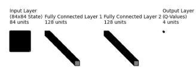

Figure 1: The simple Baseline architecture for DQN (A type) 

Figure 2: The advanced CNN architecture for DQN (B type) 

Loss Curves: 

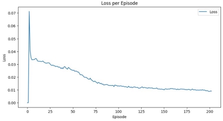

Figure 3: The loss curve for experiment 01 

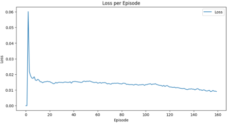

Figure 4: The loss curve for experiment 02 

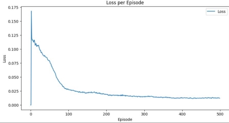

Figure 4: The loss curve for experiment 03 

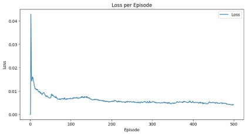

Figure 5: The loss curve for experiment 04 

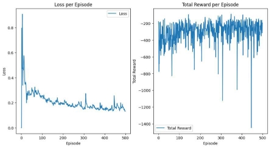

Figure 6: The loss curve and reward curve for experiment 05 

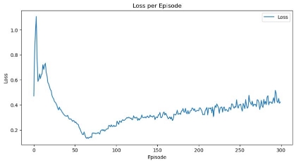

Figure 7: The loss curve for experiment 06 (Coverage distance = 3, UAVs = 3, User = 10, map size = 15x15) 

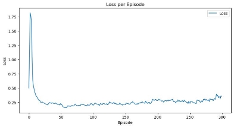

Figure 8: The loss curve for experiment 06 (Coverage distance = 5, UAVs = 3, User = 10, map size = 15x15) 

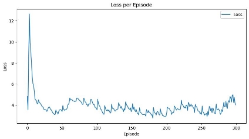

Figure 9: The loss curve for experiment 07 

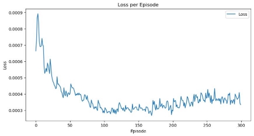

Figure 10: The loss curve for experiment 08 

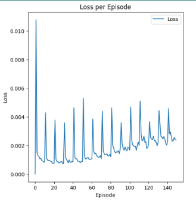

Figure 11: The loss curve for experiment 09 
